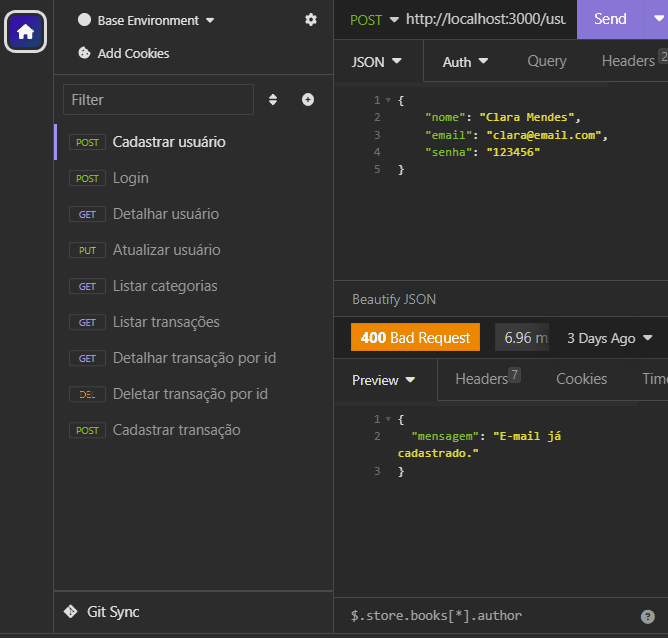

# Desafio Módulo 3 - Backend

## Pré-visualização



## Descrição do Projeto

Este projeto é uma RESTful API para controle de finanças pessoais. Ele foi desenvolvido utilizando Node.js com JavaScript e utiliza o PostgreSQL como banco de dados.

## Funcionalidades
- Cadastrar Usuário
- Fazer Login
- Detalhar Perfil do Usuário Logado
- Editar Perfil do Usuário Logado
- Listar categorias
- Listar transações
- Detalhar transação
- Cadastrar transação
- Editar transação
- Remover transação
- Obter extrato de transações
- Filtrar transações por categoria

## Pré-requisitos

Para utilizar a aplicação, certifique-se de ter os seguintes recursos instalados:

- Node.js 
- Editor SQL
- Ferramenta de teste de APIs

## Instalação

Para configurar o projeto em seu ambiente local, siga estas etapas:

1. Clone o repositório:

   ``` bash
   git clone https://github.com/sahrarafaela/desafio-backend-m03-b2bt05
   ```

2. Navegue até a pasta do projeto:

   ```bash
   cd desafio-backend-m03-b2bt05
   ```

3. Instale as dependências:

   ```bash
   npm install
   ```

4. Execute o arquivo [`dump.sql`](dump.sql) em seu editor/gerenciador SQL (por exemplo, Beekeeper) para configurar o banco de dados.

5. Crie um arquivo `.env` na raiz do projeto com as seguintes variáveis:

   ```
   PORT=porta_do_banco_de_dados
   HOST=seu_host
   USER=seu_usuario
   PASSWORD=sua_senha
   DATABASE=seu_banco_de_dados
   SENHA_JWT=sua_senha_jwt
   ```

6. Inicie o servidor:

   ```
   npm run dev
   ```

## Como utilizar

Você pode utilizar o projeto com uma ferramenta de teste e depuração de APIs, como o Insomnia. O projeto estará rodando no host definido pelo usuário no arquivo `.env` e utilizando a porta `3000` do servidor, definida no arquivo [`index.js`](./src/index.js).

### Endpoints e exemplos de requisição

- **Cadastrar Usuário**

  `POST` `/usuario`

  Esta rota permite que o usuário cadastre-se na aplicação.

  Exemplo de requisição
  ```
  // POST /usuario
  {
      "nome": "José",
      "email": "jose@email.com",
      "senha": "123456"
  }
  ```

- **Login do Usuário**

  `POST` `/login`

  Essa é a rota que permite o usuario cadastrado realizar o login no sistema.

  Exemplo de requisição
  ```
  // POST /login
  {
      "email": "jose@email.com",
      "senha": "123456"
  }
  ```

- **Detalhar Usuário**

  `GET` `/usuario`

  Essa rota detalha os dados do perfil do usuário (exceto a senha).

  Exemplo de requisição
  ```
  // GET /usuario
  // Sem conteúdo no corpo (body) da requisição
  ```

- **Atualizar Usuário**

  `PUT` `/usuario`

  Essa rota identifica o ID presente no token de autenticação e realiza alterações nos dados do usuário logado.

  Exemplo de requisição
  ```
  // PUT /usuario
  {
      "nome": "José de Abreu",
      "email": "jose_abreu@email.com",
      "senha": "j4321"
  }
  ```

- **Listar Categorias**

  `GET` `/categoria`

  Essa rota lista todas as categorias cadastradas (apenas se o usuário estiver logado).

  Exemplo de requisição
  ```
  // GET /categoria
  // Sem conteúdo no corpo (body) da requisição
  ```

- **Cadastrar Transação para o Usuário Logado**

  `POST` `/transacao`

  Essa rota cadastra uma nova transação para o usuário atualmente logado.

  Exemplo de requisição
  ```
  // POST /transacao
  {
      "tipo": "entrada",
      "descricao": "Salário",
      "valor": 300000,
      "data": "2022-03-24T15:30:00.000Z",
      "categoria_id": 6
  }
  ```

- **Listar Transações do Usuário Logado**

  `GET` `/transacao`

  Essa rota deve ser chamada quando o usuário logado quiser listar todas as transações cadastradas por ele.

  Exemplo de requisição
  ```
  // GET /transacao
  // Sem conteúdo no corpo (body) da requisição
  ```

- **Detalhar uma Transação do Usuário Logado**

  `GET` `/transacao/:id`

  Detalha uma única transação identificada através do ID passado no params (apenas se ela pertencer ao usuário).

  Exemplo de requisição
  ```
  // GET /transacao/:id
  // Sem conteúdo no corpo (body) da requisição
  ```


- **Atualizar Transação do Usuário Logado**

  `PUT` `/transacao/:id`

  Atualiza os dados de uma transação (apenas se ela pertencer ao usuário autenticado).

  Exemplo de requisição
  ```
  // PUT /transacao/2
  {
    "descricao": "Sapato amarelo",
    "valor": 15800,
    "data": "2022-03-23 12:35:00",
    "categoria_id": 4,
    "tipo": "saida"
  }
  ```

- **Excluir Transação do Usuário Logado**

  `DELETE` `/transacao/:id`

  Exclui uma das transações cadastradas pelo usuário logado.

  Exemplo de requisiçao
  ```
  // DELETE /transacao/2
  // Sem conteúdo no corpo (body) da requisição
  ```

- **Obter Extrato de Transações**

  `GET` `/transacao/extrato`

  Essa rota obtem o extrato (total de entradas e saídas) das transações do usuário

  Exemplo de requisição
  ```
  // DELETE /transacao/extrato
  // Sem conteúdo no corpo (body) da requisição
  ```

- **[EXTRA] Filtrar transações por categoria**

  `GET` `/transacao?filtro`

  Retorna as transações do usuário logado filtradas por categoria.

  Exemplo de requisição
  ```
  // GET /transacao?filtro[]=roupas&filtro[]=salários
  // Sem conteúdo no corpo (body) da requisição
  ```

## Contribuidoras

- [sahrarafaela](https://github.com/sahrarafaela)
- [marriett](https://github.com/marriett)
- [livnascimento](https://github.com/livnascimento)

---

Este projeto foi desenvolvido como Desafio do Módulo 3 do curso de Backend  da [Cubos Academy](https://cubos.academy/).
